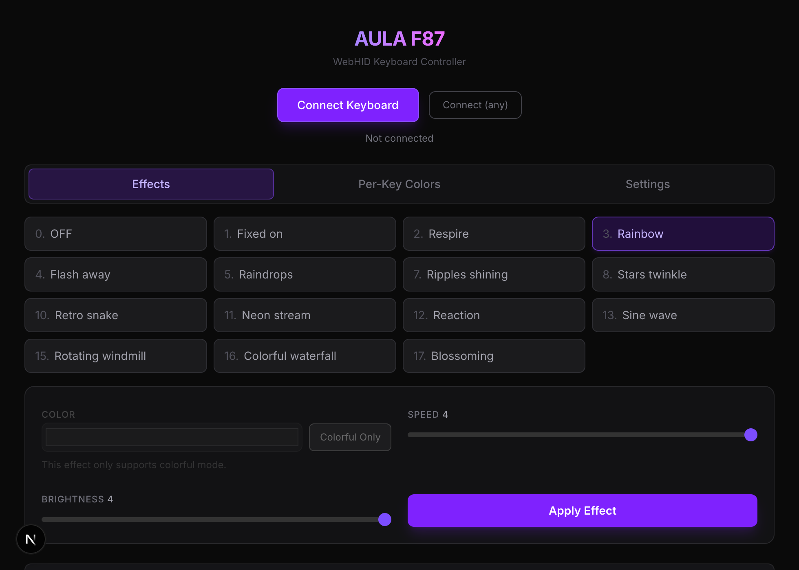
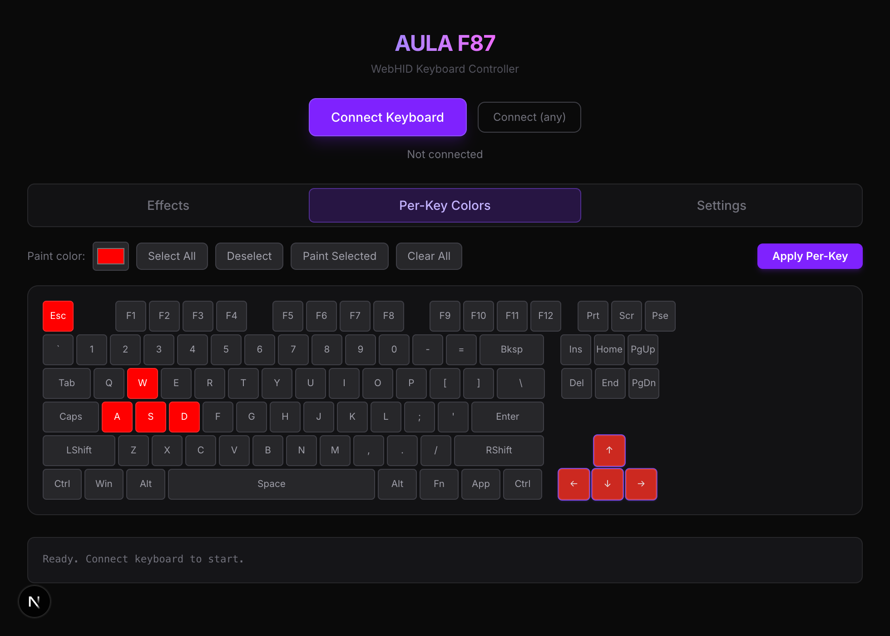
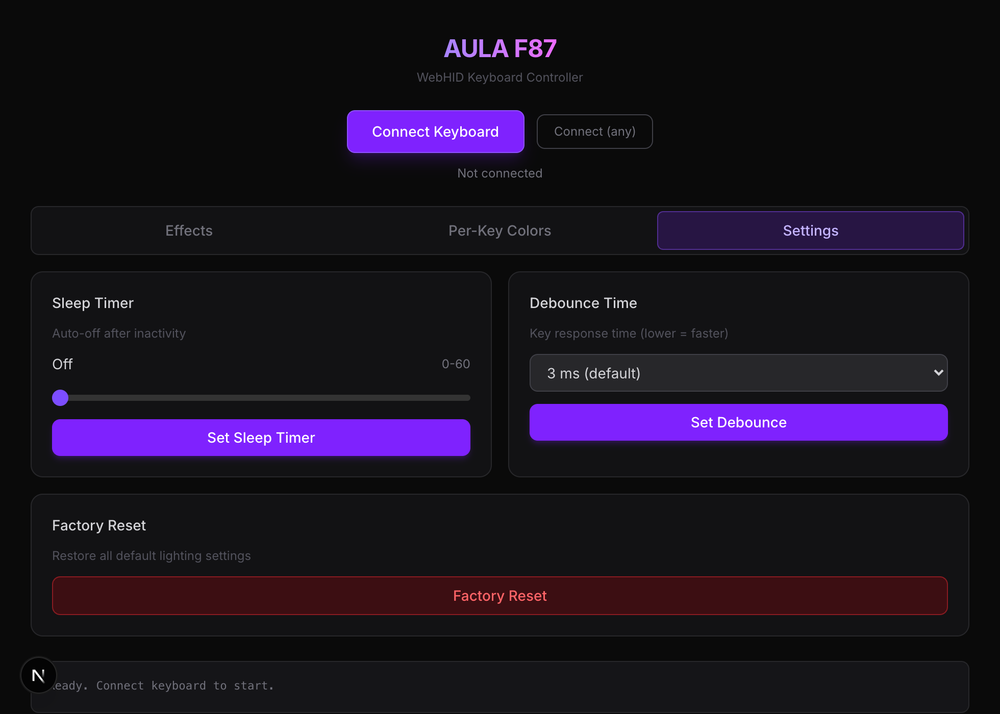
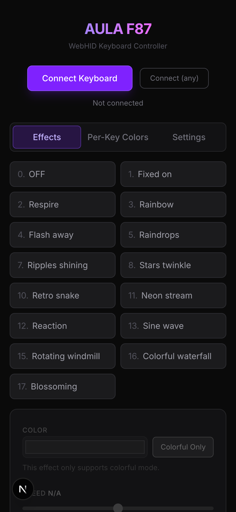

# AULA F87 Controller

Open-source lighting controller for the AULA F87 keyboard. Supports both a browser-based web app (WebHID) and a Python CLI (USB HID).

Protocol reverse-engineered from USB captures of the OEM Windows app.

---

## Features

| Feature | Web App | CLI |
|---------|:-------:|:---:|
| **Lighting Effects** | 17 built-in effects | 17 built-in effects |
| Per-key RGB colors | Yes | Yes |
| Brightness control (0-4) | Yes | Yes |
| Speed control (0-4) | Yes | Yes |
| Custom color / Colorful mode | Yes | Yes |
| Sleep timer (0-60 min) | Yes | Yes |
| Debounce time (1-5 ms) | Yes | Yes |
| Factory reset | Yes | Yes |
| Read current config | — | Yes |
| Raw HID debugging | — | Yes |

### Lighting Effects

| # | Name | Speed | Color |
|---|------|:-----:|:-----:|
| 0 | OFF | — | — |
| 1 | Fixed on | — | Custom |
| 2 | Respire | Yes | Custom/Colorful |
| 3 | Rainbow | Yes | Colorful only |
| 4 | Flash away | Yes | Custom/Colorful |
| 5 | Raindrops | Yes | Custom/Colorful |
| 7 | Ripples shining | Yes | Custom/Colorful |
| 8 | Stars twinkle | Yes | Custom/Colorful |
| 10 | Retro snake | Yes | Custom/Colorful |
| 11 | Neon stream | Yes | Custom/Colorful |
| 12 | Reaction | Yes | Custom/Colorful |
| 13 | Sine wave | Yes | Custom/Colorful |
| 15 | Rotating windmill | Yes | Colorful only |
| 16 | Colorful waterfall | Yes | Colorful only |
| 17 | Blossoming | Yes | Colorful only |

---

## Screenshots

**Effects Panel** — 17 built-in lighting effects with speed, brightness and color controls



**Per-Key Colors** — paint individual keys or groups with any RGB color



**Settings** — sleep timer, debounce time, factory reset



**Mobile**



---

## Web App

A Next.js app that communicates with the keyboard directly from the browser via the [WebHID API](https://developer.mozilla.org/en-US/docs/Web/API/WebHID_API).

**Live:** https://aula-f87-controller.vercel.app

No drivers or software installation required — works in Chromium-based browsers that support WebHID.

### Running locally

```sh
cd web
bun install
bun dev
```

Open http://localhost:3000.

### Update screenshots and demo video

To regenerate `docs/screenshots/` (requires Google Chrome):

```sh
cd web
bun run capture        # If dev server is already running
bun run capture:start  # Auto-start server, capture, then stop
```

Outputs: `effects-panel.png`, `perkey-panel.png`, `settings-panel.png`, `mobile-view.png`, `demo.webm`

---

## Python CLI

A command-line tool for scripting and automation. Works on macOS and Linux without `sudo`.

See [`python-cli/README.md`](python-cli/README.md) for setup instructions and usage.

Quick start:

```sh
cd python-cli
uv run aula_f87.py list
uv run aula_f87.py effect 3        # Rainbow
uv run aula_f87.py effect 0        # Off
```

---

## Protocol

HID protocol notes are in [`docs/PROTOCOL.md`](docs/PROTOCOL.md).
